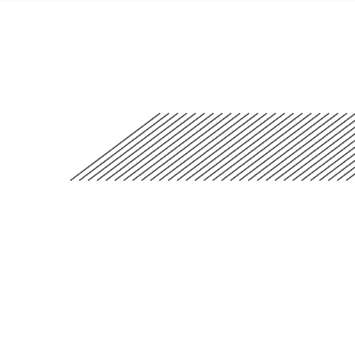

## Homework 4 (due Saturday, February 23, 2019, 11:59pm)

You will be submitting each homework assignment into a new GitHub repository each week. [Here are instructions on how to do so.](https://github.com/zamfi/github-guide/blob/master/README.md) Please [email me](mailto:michael.toren@cca.edu) if you have any questions.

### Practice with Loops

In class and in last week's homework, we talked about how loops work. Here's a brief refresher on `for` loops in particular:

```javascript
for (var i = 0; i < 10; i = i + 1) {
  print(i);
}
```

- `var i = 0;` -- The **initializer** section, runs before the loop starts
- `i < 10` -- The **condition** section, runs each time through the loop to check if loop should run again
- `i = i + 1` -- The **increment** section, runs after the loop body to change the loop variable
- `print(i)` -- The **body**, the actual code in the loop that is run repeatedly

If you want more resources on these loops, also consider the [Khan academy tutorial about loops](https://www.khanacademy.org/computing/computer-programming/programming/looping/pt/intro-to-while-loops).

Now, consider the following sketch:

```javascript
function setup() {
  createCanvas(400, 400);
}

function draw() {
  background(255);

  for (var x = 10; x < width-10; x = x + 10) {
    line(x, height/2, mouseX, mouseY);
  }
}
```

**Assignment**: Answer the following questions in your homework repository's `README.md` file:

1. How many lines are drawn each frame? In other words, how often does the `for` loop run?
2. What do the first, second, and third appearances of the number `10` do in the code?

Next, make the following changes:

1.  **Assignment**: Increase the left and right margins on the sketch by changing the **initializer** and **condition** of the `for` loop above. Save in your repo as `bigger-margins.js`.
2.  **Assignment**: Spread the lines further apart by changing the **increment** of the `for` loop above. Save in your repo as `spaced-lines.js`.
3.  **Assignment**: Modify the code above to draw each line in a different color. Consider using `HSB` color mode and re-using the `x` variable as the hue. Save in your repo as `colored-lines.js`.


Consider this set of incomplete code:

```javascript
function setup() {
  createCanvas(400, 400);
  colorMode(HSB);
}

function draw() {
  background(255);

  for (var x = ???; x < ???; x = x + ???) {
    line(x, height/2, x+100, height/2-75);
  }
}
```

1.  **Assignment**: Replace each `???` in the code above with an expression (that is, a number or mathematical expression that produces a number, like `width + 20`) to create a sketch that looks something like this:

    

    Save in your repo as `angle-lines.js`.

2.  **Optional Challenge**: Animate this sketch by having the angled lines march forward or backwards. Save in your repo as `lines-on-the-move.js`

<br>
<br>

Lastly, starting with this very slow code:

```javascript
function setup() {
  createCanvas(400, 400);
  colorMode(HSB, width, height, 100);
}

function draw() {
  var x = random(width);
  var y = random(height);

  stroke(x, y, 100);
  point(x, y);
}
```

Right now, this code just draws a single pixel per frame (using the `point` funxtion) -- but there are 160,000 pixels total, so filling the canvas will take a while!

**Assignment**: Add a `for` loop to the `draw` function so that, each frame, the code draws `100` pixels instead of just one. What does a `for` loop that runs 100 times look like?

### Practice with Arrays

In class and in last week's homework, we talked about how arrays work. Here's a brief refresher:

- `var listName = [];` -- create a new array
- `listName[3]` -- access item at index 3 (the *fourth* item) in the array
- `listName[3] = 7` -- set the item at index 3 to the number 7.
- `listName.push(12)` -- add the number 12 to the end of the array
- `listName.length` -- get the number of elements in the array

If you want more resources on arrays, also consider the [Khan academy tutorial on arrays](https://www.khanacademy.org/computing/computer-programming/programming/arrays/pt/intro-to-arrays).

Now, here's a sketch that relies on arrays and a loop:

```javascript
function setup() {
  createCanvas(400, 400);
}

var x = []; // new empty array
var y = []; // new empty array

function draw() {
  background(255);
  noFill();

  x.push(mouseX); // equivalent to append(x, mouseX)
  y.push(mouseY); // equivalent to append(y, mouseY)

  for (var i = 0; i < x.length; i = i + 10) {
    ellipse(x[i], y[i], 1 + (x.length - i));
  }

  x = x.slice(-50); // keep the last 50 x values
  y = y.slice(-50); // keep the last 50 y values
}
```

**Assignment:** Answer the following questions in your homework repository's README.md file:

1. How many times does the loop body run each frame, once the `x` and `y` arrays are full?
2. What are two ways of increasing the spacing between rings?
3. How can you make the ellipse trail longer?

Next, make the following changes:

1. **Assignment**: Increase the number of concentric circles from 5 to 10. Save in your repo as `10-circles.js`.
2. **Assignment**: Modify the code to draw squares instead of circles, of the same width and height. Save in your repo as `square-circles.js`
3. **Optional Challenge**: Modify the code to draw a different shape altogether. Maybe use a triangle, or make a custom shape using `beginShape` and `vertex`! (Look these up in the [p5.js reference](http://p5js.org/reference)) Save in your repo as `other-circles.js`.
